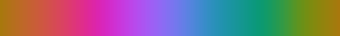

# react-volume-viewer

> Aframe container with custom controls for use in react applications

[](https://www.npmjs.com/package/react-volume-viewer) [](https://standardjs.com)

## Development

Clone repo and run `npm install`

Run `npm start` in one terminal and `cd example && npm start` in a second terminal. The first terminal will detect changes in the library and the second will deploy the example on [http://localhost:3000](http://localhost:3000)

## Install

```bash
npm install react-volume-viewer
```

## Props

The only required props are the model's path, name, and its minimum and maximum data points. The model's path should be imported into the project and passed in from there - see the [example project](#example).

CSS styling for the height must be provided, otherwise the height of the component will be 0px. This can be accomplished with `styled-components` if desired.

```jsx

VolumeViewer.propTypes = {
  /** Blending enum
   *  Max: Take maximum value at the given point
   *  Min: Take minimum value at the given point
   *  Average: Average all models at each point
   */
  blending: PropTypes.oneOf(Object.values(Blending)),

  /** Whether or not the controls can be seen */
  controlsVisible: PropTypes.bool,

  /** Array of models loaded into aframe (REQUIRED)
   *    colorMap: Object containing the path to the current color image applied to the model.
   *      name: Common name of the color map (REQUIRED)
   *      path: Path to the color map source image (REQUIRED)
   *    colorMaps: Array of color maps available to the model (controls dropdown)
   *      colorMap must be present in colorMaps
   *      Each colorMap in colorMaps must have a unique name
   *    description: Short description of the model
   *    enabled: Flag to display the model
   *    intensity: Multiplication factor for voxels intensity
   *    name: Unique name given to the model (REQUIRED)
   *    path: Path to the model (REQUIRED)
   *    range: Minimum and maximum values of the model's dataset
   *    transferFunction: The transfer function applied to the color map
   *      Array of {x: <val>, y: <val>} coordinates.
   *      Each coordinate in transferFunction must be between (0, 0) and (1,1)
   *    useTransferFunction: Flag to apply a transfer function to the model
   *    useColorMap: Flag to apply a color map to the model
   */
  models: MODEL,

  /** Position of the dataset in the scene as a "<x> <y> <z>" string
   *    x, y, and z must be valid numbers and are space separated
   */
  position: PropTypes.string,

  /** Position of the dataset in the scene as a "<x> <y> <z>" string
   *    x, y, and z must be valid numbers and are space separated
   */
  rotation: PropTypes.string,

  /** Scale of the dataset in the scene as a "<x> <y> <z>" string
   *    x, y, and z must be valid numbers and are space separated
   */
  scale: PropTypes.string,

  /** Number of slices used to generate the model (REQUIRED) 
   *    slices must be a positive integer
   */
  slices: PropTypes.number.isRequired,

  /** Spacing between the slices of the models a "<x> <y> <z>" string (REQUIRED)
   *    x, y, and z must be valid numbers and are space separated
   */
  spacing: PropTypes.string.isRequired,

  /** 
   * Sliders for control of clipping along the x, y, and z axes 
   * SLIDER is an array of exactly two values between 0 and 1. slider[0] must be <= slider[1].
   *  slider[0]: Minimum slider value
   *  slider[1]: Maximum slider value
   */
  sliders: PropTypes.exact({
    x: SLIDER,
    y: SLIDER,
    z: SLIDER,
  }),
};
```

## Default Props

Default values are provided for props that are not required. The required props are `models`, `slices`, and `spacing`.

```jsx
VolumeViewer.defaultProps = {
  blending: Blending.None,
  controlsVisible: false,
  position: "0 0 0",
  rotation: "0 0 0",
  scale: "1 1 1",
  sliders: {
    x: [0, 1],
    y: [0, 1],
    z: [0, 1],
  };,
};
```

## Exports

### VolumeViewer

`<VolumeViewer />` is the main component exported by this library. It's expected props are detailed above.

## Blending

The `Blending` object is used as an enum for the different algorithms that can be used to blending the models together.

```js
const Blending = {
  Max: 0,
  Min: 1,
  Average: 2,
};

```

### COLOR_MAPS

`COLOR_MAPS` is an object containing some example colormaps. Any/all of the color maps can be imported into your project and passed into `[model].colorMaps`.

| Name      | Image |
|:-:        |:-:    |
| **Algae** |  |
|  **Amp**  |  |
|  **Balance**  |  |
|  **Curl**  |  |
|  **Deep**  |  |
|  **Delta**  |  |
|  **Dense**  |  |
|  **Diff**  |  |
|  **Grayscale**  |  |
|  **Grayscale_reverse**  |  |
| **Haline**|  |
| **Ice**|  |
| **Matter**|  |
| **Natural**|  |
| **Oxy**|  |
| **Phase**|  |
| **Rain**|  |
| **Rgb**|  |
| **Solar**|  |
| **Speed**|  |
| **Tarn**|  |
| **Tempo**|  |
| **Thermal**|  |
| **Topo**|  |
| **Turbid**|  |

### DEFAULT_MODEL

The `DEFAULT_MODEL` object holds all of the default properties for a single model.

It will be merged with every `model` in the `models` array. Note, however, that there is no default value for `name`, or `path`. Each of these properties are required.

```js
{
  colorMap: COLOR_MAPS.Grayscale,
  colorMaps: [],
  description: "",
  enabled: true,
  intensity: 1,
  range: { min: 0, max: 1, unit: "" },
  transferFunction: [
    { x: 0, y: 0 },
    { x: 1, y: 1 },
  ],
  useTransferFunction: true,
  useColorMap: true,
};
```

### DEFAULT_SLIDERS

The `DEFAULT_SLIDERS` export is the default value for the `sliders` prop. It will be applied automatically if you do not pass `sliders` into `<VolumeViewer />`.

```js
{
  x: [0, 1],
  y: [0, 1],
  z: [0, 1],
};
```

## Example

An example project can be found on the [GitHub Page](https://brown-ccv.github.io/react-volume-viewer/) of this repo.

```jsx
import React from 'react'
import styled from 'styled-components'
import { VolumeViewer, COLOR_MAPS } from "react-volume-viewer";

import model1 from "./path/to/model.png";
import model2 from "./path/to/model.png";

const haline = { name: "Haline", path: "./assets/colormaps/haline.png" };
const thermal = { name: "Thermal", path: "./assets/colormaps/thermal.png" };

function App() {
  const [controlsVisible, setControlsVisible] = React.useState(true);
  const [enabled, setEnabled] = React.useState(true)

  return (
    <StyledVolumeViewer
      controlsVisible={controlsVisible}
      models={[
        {
          name: "Salt",
          colorMap: haline,
          colorMaps={[haline, thermal, COLOR_MAPS.Grayscale]}
          description: "Model visualizing salinity data",
          path: {model1},
          range: {
            min: 0.05,
            max: 33.71,
          },
          path: model1,
          transferFunction: [
            { x: 0, y: 0 },
            { x: 0.5, y: 0.5 },
            { x: 1, y: 1 },
          ],
        },
        {
          name: "Temperature",
          colorMaps={[...Object.values(COLOR_MAPS)]}
          enabled: enabled,
          description: "Model visualizing temperature data",
          path: {model2},
          range: {
            min: 2.5,
            max: 42,
            unit: "°C",
          },
          useTransferFunction: false,
          useColorMap: false,
        },
      ]}
      rotation="-55 0 0"
      scale="1 -1 1"
      slices={50}
      spacing="2 2 1"
    />
  )
}

const StyledVolumeViewer = styled(VolumeViewer)`
  height: 50vh;
`;

export default App
```

### Tiff to PNG

The models in the example app are created using [tiff-volume-2png](https://github.com/brown-ccv/tiff-volume-2png). The program converts tiff image sequences to down-scaled 2D images - the format this volume viewer requires.

## License

MIT © [brown-ccv](https://github.com/brown-ccv)
